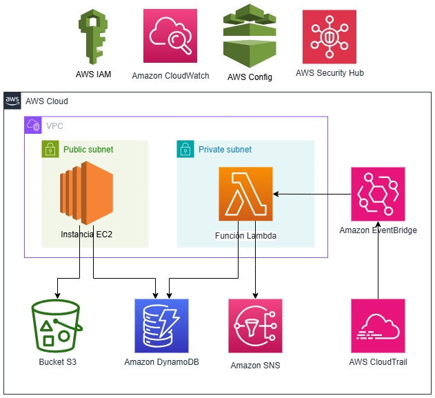

# Reto 1: Despliegue de recursos a través de la consola de AWS

## 1. Contexto y objetivo

Para la ejecución de los 3 retos de la Fase 1 del Semillero AWS Ciber🚀supondremos un escenario base que nos servirá para aprender los servicios básicos de AWS, su configuración y funcionamiento.

### Objetivo general:
- Desarrollar las competencias fundamentales en AWS de manera práctica, desde el nivel principiante hasta un nivel práctico intermedio, capacitando a los participantes para diseñar, implementar y mantener arquitecturas seguras y eficientes en la nube que cumplan con los estándares y políticas de la organización, preparándolos así para contribuir efectivamente en iniciativas de transformación digital y proyectos de migración dentro de la organización.

### Objetivo específico del Reto 1:
- Aprender a utilizar la consola de administración de AWS, familiarizándose con su interfaz, servicios principales y navegación eficiente
- Desplegar y configurar recursos de uso común en AWS de manera manual, entendiendo sus interrelaciones y mejores prácticas
- Explorar y aplicar los servicios enfocados en la Seguridad y Monitoreo en AWS para proteger la infraestructura según los requerimientos organizacionales

## 2. Arquitectura escenario base

El Hotel "Cloud Suites" necesita implementar un sistema de gestión de reservas en la nube para optimizar sus operaciones y mejorar la experiencia de sus clientes. Como especialista en AWS, has sido contratado para diseñar e implementar esta solución utilizando diversos servicios de la nube de Amazon.

Se desea desarrollar un sistema de reservas que permita crear, modificar, eliminar y visualizar reservas de habitaciones, validar disponibilidad y notificar cuando existan conflictos en las reservaciones.

El sistema constará de los siguientes componentes de AWS:



- **VPC (Virtual Private Cloud)**  
  La VPC es un recurso de red y permite controlar la conectividad y la seguridad. Se tendrá una Subnet privada donde estarán los recursos sensibles y una Subnet pública que se podrá alcanzar desde Internet.

- **EC2 (Elastic Cloud Computing)**  
  Una instancia EC2 es un recurso de cómputo (servidor) y permitirá alojar la aplicación web desarrollada en Python con el framework Flask para la interfaz de usuario.  
  *Nota: No tendrás que desarrollar la lógica del servidor web. Adjunto al reto encontrarás el archivo app.py. También en la guía se entrega el paso a paso de los comandos Linux para su despliegue.*

- **Bucket S3 (Simple Storage Service)**  
  Un Bucket de S3 es un recurso que permite almacenar archivos en la nube (documentos, imágenes, videos, etc.). Guardará archivos estáticos de la aplicación web y documentos de identidad de los huéspedes.

- **Lambda en Python**  
  Una función Lambda es un recurso de cómputo de tipo "Serverless" o "Sin servidor", que permite ejecutar código fuente sin necesidad de administrar servidores. Validará las nuevas reservas para detectar conflictos (misma habitación y fechas).  
  *Nota: No tendrás que desarrollar la lógica en Pyhton. Adjunto al reto encontrarás el archivo lambda_function.py.*

- **DynamoDB**  
  Una DyanmoDB es una base de datos no relacional (NoSQL) que almacenará la información de las reservas y habitaciones.

- **Amazon CloudWatch Event (EventBridge)**  
  Un evento de EventBridge permite disparar una ejecución basándose en reglas o programación de calendario. Disparará la función Lambda cuando se cree o modifique una reserva en DynamoDB.

- **Amazon SNS (Simple Notification Service)**  
  Un SNS es un servicio que permite realizar notificaciones de manera asíncrona. Enviará notificaciones por correo electrónico al administrador del hotel (tú) cuando se detecten conflictos.

- **IAM Role**  
  Un Rol de IAM es una identidad en AWS que agrupa permisos hacia otros recursos de AWS. Gestionará los permisos necesarios entre los distintos servicios.

- **Servicios de Seguridad y Monitoreo**  
  Estos servicios no hacen parte de la arquitectura base como tal, sin embargo, como miembros del Entorno de Ciberseguridad es importante conocerlos y aprenderlos a utilizar:
  - **AWS IAM**: Configuración de roles y políticas para cada recurso, asegurando el principio de menor privilegio
  - **AWS CloudTrail**: Registra todas las llamadas a la API de AWS realizadas en la cuenta, lo que permite auditar actividades
  - **Amazon CloudWatch**: Se utiliza para almacenar y visualizar logs (por ejemplo, logs de la aplicación web y la función Lambda) y para configurar alarmas
  - **AWS Config**: Se utiliza para realizar evaluaciones de la conformidad de las configuraciones de los recursos desplegados
  - **AWS Security Hub**: Centraliza los hallazgos e incumplimientos encontrados por diferentes herramientas sobre los recursos de la cuenta

## 3. Uso responsable de Cuenta AWS Sandbox

La organización cuenta con un conjunto de cuentas independiente a las productivas para que los equipos realicen pruebas de concepto.

Para el desarrollo del Semillero, utilizaremos la cuenta CiberseguridadSBX. Esta cuenta genera una facturación por uso para la organización, por lo que debemos ser muy responsables en la creación de nuevos recursos, limitándonos a los indicados en el reto.

**Enlace para Consola de AWS SBX:**  
https://d-906705dbfe.awsapps.com/start#/

**Nombramiento de recursos:**  
Con el fin de identificar los recursos que han sido creados en el semillero y realizar una posterior depuración de estos al finalizar, seguiremos el siguiente nombramiento de TODOS los recursos que se creen para cada uno de los retos:

```
semillero-[USUARIO]-[NOMBRE-DEL-RECURSO]
```

Ejemplo:
```
semillero-danirend-miprimerbucket
```

# Guía paso a paso de implementación

A continuación, se deja un paso a paso detallado de cómo realizar la implementación de la solución.

> 💡 Si tienes conocimientos previos en AWS y quieres hacerlo por tu cuenta ¡Adelante! Acá tendrás igualmente la guía si tienes alguna duda.

## Paso 1: Creación del bucket S3

1. **Acceder a S3:**
   - Inicia sesión en la consola de AWS.
   - En la barra de búsqueda superior, escribe "S3" y selecciona el servicio.

2. **Crear un bucket:**
   *Las configuraciones que no se indiquen deberán dejarse por defecto.*
   - Haz clic en el botón "Crear bucket".
   - Nombre del bucket: `semillero-[USUARIO]-hotel-reservations` (debe ser único globalmente, si te dice que ya existe agrégale números al final).
   - Región AWS: Selecciona la misma región que usarás para todos los servicios (siempre será us-east-1).
   - Configuración de bloqueo de acceso público: Mantén todas las opciones marcadas.
   - Control de versiones: Deshabilitado.
   - Mantén las demás opciones con valores predeterminados.
   - Haz clic en "Crear bucket".

3. **Crear estructura de carpetas:**
   - Abre el bucket recién creado.
   - Haz clic en "Crear carpeta".
   - Crea una carpeta llamada `statics`.
   - Crea otra carpeta llamada `documents`.

4. **Modificar la política del bucket para acceso público a los archivos estáticos:**
   - Selecciona el bucket y ve a la pestaña "Permisos".
   - Desplázate hasta "Política de bucket" y haz clic en "Editar".
   - Pega la siguiente política (reemplaza [USUARIO]):
   ```json
   {
     "Version": "2012-10-17",
     "Statement": [
         {
             "Sid": "PublicReadForStaticContent",
             "Effect": "Allow",
             "Principal": {
                 "AWS": "arn:aws:iam::513231983165:root"
             },
             "Action": "s3:GetObject",
             "Resource": "arn:aws:s3:::semillero-[USUARIO]-hotel-reservations/static/*"
         }
     ]
   }
   ```
   - Haz clic en "Guardar cambios".

## Paso 2: Creación de la tabla DynamoDB

1. **Acceder a DynamoDB:**
   - En la barra de búsqueda superior, escribe "DynamoDB" y selecciona el servicio.

2. **Crear tabla:**
   - Haz clic en "Crear tabla".
   - Nombre de la tabla: `semillero-[USUARIO]-HotelReservations`
   - Clave de partición: `ReservationID` (tipo String).
   - Desmarca "Agregar clave de ordenación".
   - En "Configuración de la tabla", selecciona "Personalizar configuración".
   - Modo de capacidad: Selecciona "Bajo demanda".
   - Mantén las demás opciones con valores predeterminados.
   - Haz clic en "Crear tabla".

## Paso 3: Creación del tema SNS

1. **Acceder a SNS:**
   - En la barra de búsqueda superior, escribe "SNS" y selecciona el servicio.

2. **Crear tema:**
   - Haz clic en "Crear tema".
   - Tipo: Estándar.
   - Nombre: `semillero-[USUARIO]-HotelReservationConflicts`
   - Nombre para mostrar: `semillero-[USUARIO]-HotelReservationAlert`
   - Mantén las demás opciones con valores predeterminados.
   - Haz clic en "Crear tema".

3. **Crear suscripción:**
   - Después de crear el tema, aparecerá la página de detalles del tema.
   - Haz clic en "Crear suscripción".
   - Protocolo: Email.
   - Punto de conexión: Ingresa tu dirección de correo electrónico (simulando ser el administrador del hotel).
     Puedes usar tu correo corporativo
   - Haz clic en "Crear suscripción".
   - **Importante**: Abre tu correo electrónico y busca un correo de AWS Notification.
     Debes confirmar la suscripción haciendo clic en el enlace recibido.

## Paso 4: Creación de VPC con Subnets Pública y Privada
> NOTA: Debido a la limitante técnica que solo se permiten crear 5 VPC por cuenta de AWS. Se debe saltar el paso 4 y utilizar la siguiente VPC creada para el reto:
semillero-danirend-vpc-hotel
Se deja el paso a paso para que tengan presente cómo se configura y que se realizó:

1. **Acceder a VPC:**
   - En la barra de búsqueda superior, escribe "VPC" y selecciona el servicio.

2. **Crear VPC:**
   - Haz clic en "Crear VPC".
   - Selecciona "VPC y más" para crear todos los recursos asociados.
   - Nombre del proyecto: `semillero-[USUARIO]-vpc-hotel`
   - Bloque de CIDR IPv4: `10.0.0.0/16`

3. **Configuración de subnets:**
   - Número de zonas de disponibilidad: `1`
   - Número de subnets públicas: `1`
   - Número de subnets privadas: `1`

4. **Gateway NAT:**
   - Selecciona `1 por zona de disponibilidad` 
   - Esto creará una NAT Gateway que permite que los recursos en la subnet privada (Lambda) puedan acceder a internet

5. **Puntos de enlace a la VPC:**
   - En esta sección es donde se configuran los "Gateway endpoints"
   - Selecciona `Gateway de S3`
   - Si aparece la opción para DynamoDB, selecciónala también

6. **Opciones de DNS:**
   - Mantén ambas casillas marcadas:
     - Habilitar nombres de host DNS
     - Habilitar la resolución de DNS

7. **Haz clic en "Crear VPC".**

8. **Añadir Gateway Endpoint para DynamoDB (si no estaba disponible antes):**
   - Una vez creada la VPC, ve a la sección "Puntos de conexión" en el panel izquierdo
   - Haz clic en "Crear punto de conexión"
   - Categoría de servicio: Servicios de AWS
   - Busca y selecciona "com.amazonaws.us-east-1.dynamodb" (ajusta la región si estás en otra)
   - Selecciona la VPC que acabas de crear
   - En "Configurar tablas de enrutamiento", selecciona las tablas de ambas subnets (pública y privada)
   - Política: Acceso completo
   - Haz clic en "Crear punto de conexión"

## Paso 5: Creación del rol IAM para Lambda

1. **Acceder a IAM:**
   - En la barra de búsqueda superior, escribe "IAM" y selecciona el servicio.

2. **Crear rol:**
   - En el panel lateral, haz clic en "Roles".
   - Haz clic en "Crear rol".
   - Tipo de entidad de confianza: Servicio de AWS.
   - Caso de uso: Lambda.
   - Haz clic en "Siguiente".

3. **Agregar permisos:**
   - En el campo de búsqueda, escribe "AWSLambdaBasicExecutionRole" y selecciónalo.
   - Busca "AWSLambdaVPCAccessExecutionRole" y selecciónalo.
   - Busca "AmazonDynamoDBFullAccess" y selecciónalo.
   - Busca "AmazonSNSFullAccess" y selecciónalo.
   - Nota: Las políticas que aparecen con la Caja amarilla son las políticas administradas por AWS. La mayoría de ellas son muy permisivas y útiles en pruebas de concepto y simuladas como este caso. 
     En aplicaciones productivas, NUNCA se deben utilizar estás políticas y se debe de definir acción por acción de acuerdo con lo que se requiera, siguiendo el principio del mínimo privilegio.
   - Nota 2: En este caso no le asignaremos un Permission Boundary (Límite de permisos), sin embargo, en aplicaciones bando SIEMPRE se debe de asignar el Permission Boundary de la organización.
   - Haz clic en "Siguiente".

4. **Nombrar el rol:**
   - Nombre del rol: `semillero-[USUARIO]-LambdaHotelReservationRole`
   - Descripción: Rol para funcion Lambda de validacion de reservas de hotel.
   - Haz clic en "Crear rol".

## Paso 6: Creación de la función Lambda

1. **Acceder a Lambda:**
   - En la barra de búsqueda superior, escribe "Lambda" y selecciona el servicio.

2. **Crear función:**
   - Haz clic en "Crear función".
   - Método de creación: Autor desde cero.
   - Nombre de la función: `semillero-[USUARIO]-ValidateHotelReservation`
   - Tiempo de ejecución: Python 3.13
   - Arquitectura: x86_64.
   - Permisos: Selecciona "Usar un rol existente" y elige el rol que creaste `semillero-[USUARIO]-LambdaHotelReservationRole`
   - Configuración de VPC:
     - VPC: Selecciona la VPC que creaste `semillero-[USUARIO]-vpc-hotel`
     - Subredes: Selecciona la subnet **privada** creada
     - Grupos de seguridad: Crea un nuevo grupo de seguridad
       Nota: Si no te permite crearlo en el Menú, debes ir por el servicio EC2 y crear el Grupo de seguridad para luego seleccionarlo en este paso.
       - Nombre: `semillero-[USUARIO]-sg-lambda`
       - Descripción: Grupo de seguridad para función Lambda
       - No necesita reglas de entrada adicionales
   - Haz clic en "Crear función".

3. **Agregar código:**
   - En la sección "Código fuente", reemplaza el contenido del archivo lambda_function.py con el código adjunto al reto en el archivo lambda_function.py
   - Haz clic en "Implementar" (Deploy).

4. **Configurar variables de entorno:**
   - Haz clic en la pestaña "Configuración" y en el menú lateral selecciona "Variables de entorno".
   - Haz clic en "Editar".
   - Haz clic en "Añadir variable de entorno".
   - Clave: `SNS_TOPIC_ARN`
   - Valor: Pega el ARN del tema SNS que creaste anteriormente (puedes encontrarlo en la página de detalles del tema SNS).
   - Clave: `DYNAMODB_TABLE`
   - Valor: Pega el NOMBRE de la tabla DynamoDB (No ARN) que creaste anteriormente (puedes encontrarlo en la página de detalles de la tabla en DynamoDB).
   - Haz clic en "Guardar".

## Paso 7: Configuración de EventBridge

1. **Acceder a EventBridge:**
   - En la barra de búsqueda superior, escribe "EventBridge" y selecciona el servicio.

2. **Crear regla:**
   - Haz clic en "Crear regla".
   - Nombre: `semillero-[USUARIO]-HotelReservationValidator`
   - Descripción: Regla para activar la validación de reservas de hotel.
   - Bus de eventos: default.
   - Haz clic en "Siguiente".

3. **Definir patrón:**
   - Origen del evento: "Eventos de AWS o eventos de socios de EventBridge"
   - Patrón de eventos: Patrón personalizado (editor JSON)
   - Copia y pega el siguiente patrón JSON
   ```json
   {
     "source": ["aws.dynamodb"],
     "detail-type": ["AWS API Call via CloudTrail"],
     "detail": {
       "eventSource": ["dynamodb.amazonaws.com"],
       "eventName": ["PutItem", "UpdateItem", "BatchWriteItem"],
       "requestParameters": {
         "tableName": ["semillero-[USUARIO]-HotelReservations"]
       }
     }
   }
   ```
   - Haz clic en "Siguiente".

4. **Seleccionar destinos:**
   - Tipo de objetivo: Servicio de AWS.
   - Seleccionar un objetivo: Función Lambda.
   - Función: `semillero-[USUARIO]-ValidateHotelReservation`
   - Haz clic en "Siguiente".

5. **Configurar etiquetas (opcional):**
   - Haz clic en "Siguiente" sin agregar etiquetas.

6. **Revisar y crear:**
   - Revisa todos los detalles.
   - Haz clic en "Crear regla".

## Paso 8: Creación del rol IAM para EC2

1. **Acceder a IAM:**
   - En la barra de búsqueda superior, escribe "IAM" y selecciona el servicio.

2. **Crear rol:**
   - En el panel lateral, haz clic en "Roles".
   - Haz clic en "Crear rol".
   - Tipo de entidad de confianza: Servicio de AWS.
   - Caso de uso: EC2.
   - Haz clic en "Siguiente".

3. **Agregar permisos:**
   - Busca y selecciona "AmazonS3FullAccess".
   - Busca y selecciona "AmazonDynamoDBFullAccess".
   - Busca y selecciona "AmazonSSMManagedInstanceCore".
   - Haz clic en "Siguiente".

4. **Nombrar el rol:**
   - Nombre del rol: `semillero-[USUARIO]-EC2HotelReservationRole`
   - Descripción: Rol para instancia EC2 del sistema de reservas de hotel.
   - Haz clic en "Crear rol".

## Paso 9: Creación de una instancia EC2

1. **Acceder a EC2:**
   - En la barra de búsqueda superior, escribe "EC2" y selecciona el servicio.

2. **Lanzar instancia:**
   - Haz clic en "Lanzar instancia".
   - Nombre: `semillero-[USUARIO]-HotelReservationWebServer`
   - Imágenes de aplicación y sistemas operativos (AMI): Amazon Linux 2023 AMI (64 bits x86).
   - Tipo de instancia: t2.micro (capa gratuita).
   - Par de claves: Crea un nuevo par de claves. 
     - Nombre del par de claves: `semillero-[USUARIO]-hotel-reservation-key`
     - Tipo de par de claves: RSA.
     - Formato de archivo de clave privada: ".ppk" si tienes Windows o ".pem" si usar Linux o MacOS.
     - Haz clic en "Crear par de claves" y guarda el archivo en un lugar seguro.

3. **Configurar red:**
   - Dar clic en "Editar"
   - Red: Selecciona la VPC que creaste `semillero-[USUARIO]-vpc-hotel`
   - Subred: Selecciona la subnet **pública** creada
   - Asignar automáticamente IP pública: Habilitar
   - Firewall (grupos de seguridad): Crear un nuevo grupo de seguridad
     - Nombre del grupo de seguridad: `semillero-[USUARIO]-sg-web-server`
     - Descripción: Grupo de seguridad para el servidor web
     - Reglas de entrada: Añade las siguientes reglas:
       - Tipo: "HTTP". Tipo de origen: "Cualquier lugar"
       - Tipo: "HTTPS". Tipo de origen: "Cualquier lugar"
       - Tipo: "TCP personalizado". Intervalo de puertos: "5000". Tipo de origen: "Cualquier lugar"

4. **Configurar almacenamiento:**
   - Mantén la configuración predeterminada (8 GiB gp3).

5. **Configuración avanzada:**
   - Expandir el menú
   - Perfil de instancia IAM: Selecciona `semillero-[USUARIO]-EC2HotelReservationRole`
   - Mantén las demás opciones con valores predeterminados.

6. **Lanzar instancia:**
   - Haz clic en "Lanzar instancia".

## Paso 10: Configurar la instancia EC2

1. **Conectar a la instancia:**
   - Luego de crearla, da clic en "Ver todas las instancias"
   - Busca en el filtro por el nombre de tu instancia
   - Espera a que la instancia esté en estado "running" o "en ejecución".
   - Haz clic en el id de la instancia para abrir el detalle
   - En la parte superior, haz clic en "Conectar"
   - Te aparecerán 4 posibles formas de conectarte, selecciona "Administrador de sesiones" o "Session Manager"
   - Haz clic nuevamente en "Conectar" en la parte inferior derecha
   
   Nota: Esta conexión se realiza a través de Session Manager, un servicio de AWS que permite realizar una conexión directa al servidor. En la organización se permite realizar unicamente para cuentas pre-productivas. Para cuentas productivas este proceso se realiza a través de CyberArk.
   
   - Se deberá abrir un terminal que nos permitirá ejecutar comandos dentro de la instancia

2. **Actualizar el sistema e instalar dependencias:**
   ```bash
   sudo yum update -y
   ```

3. **Instalar dependencias:**
   ```bash
   sudo yum install -y python3 python3-pip git
   ```

4. **Clonar el repositorio:**
   ```bash
   # Crear directorio para la aplicación
    mkdir -p /home/ssm-user/hotel-app
    cd /home/ssm-user/hotel-app

    # Clonar el repositorio
    git clone https://github.com/danielr9911/semillero-aws-ciber-reto1.git .

    # Dar permisos adecuados
    sudo chown -R ssm-user:ssm-user /home/ssm-user/hotel-app
   ```

5. **Instalar dependencias de Python:**
   ```bash
   # Integresar a la carpeta
   cd hotel-app/semillero-aws-ciber-reto1/
   pip3 install -r requirements.txt
   ```

6. **Configurar las variables de la aplicación:**
   ```bash
   # Editar el archivo app.py para configurar las variables específicas
    nano app.py
   ```
   Actualiza las siguientes líneas con tu información:

- Línea 10: Cambia S3_BUCKET_NAME = 'semillero-[USUARIO]-hotel-reservations' con tu nombre de usuario.
- Línea 11: Cambia DYNAMODB_TABLE = 'semillero-[USUARIO]-HotelReservations' con tu nombre de usuario.
Para guardar los cambios en nano:

- Presiona Ctrl+O, luego Enter
- Presiona Ctrl+X para salir

7. **Crear directorios para almacenamiento local:**
   ```bash
   # Crear directorios para documentos e imágenes locales
    mkdir -p /home/ec2-user/hotel-app/local_storage/documents
    sudo chmod 777 /home/ec2-user/hotel-app/local_storage/documents
   ```

8. **Ejecutar la aplicación:**
   ```bash
   # Crear un archivo de servicio systemd para la aplicación
    sudo tee /etc/systemd/system/hotel-app.service > /dev/null << EOL
    [Unit]
    Description=Hotel Reservation Application
    After=network.target

    [Service]
    User=ec2-user
    WorkingDirectory=/home/ec2-user/hotel-app
    ExecStart=/usr/bin/python3 app.py
    Restart=always

    [Install]
    WantedBy=multi-user.target
    EOL

    # Habilitar e iniciar el servicio
    sudo systemctl daemon-reload
    sudo systemctl enable hotel-app
    sudo systemctl start hotel-app

    # Verificar estado
    sudo systemctl status hotel-app
   ```

9. **Verificar que la aplicación esté funcionando:**
    - Abre un navegador web.
    - Ingresa la dirección IP pública de tu instancia EC2 con el puerto 5000: http://[IP-PUBLICA]:5000
    - Deberías ver la página de inicio del Sistema de Reservas del Hotel Cloud Suites.

9. **Modificar las variables de entorno en la aplicación:**
   ```bash
   nano app.py
   ```
   - Busca y actualiza la siguiente variable: 
     - S3_BUCKET_NAME: Nombre del bucket S3 que creaste (reemplaza tu usuario)
   - Guarda el archivo (Ctrl+O, luego Enter, luego Ctrl+X).

10. **Ejecutar la aplicación:**
    ```bash
    nohup python3 app.py &
    ```
    - Esto ejecutará la aplicación en segundo plano.

## Paso 11: Probar el sistema completo

1. **Acceder a la aplicación web:**
   - Abre un navegador web.
   - Introduce la dirección: `http://[IP-PUBLICA-DE-TU-EC2]:5000`.
   - Deberías ver la página principal del sistema de reservas del hotel.

2. **Crear una reserva:**
   - Navega al formulario de creación de reservas.
   - Completa los datos necesarios.
   - Sube un archivo como documento de identidad.
   - Envía el formulario.

3. **Verificar la creación en DynamoDB:**
   - Regresa a la consola de AWS.
   - Accede al servicio DynamoDB.
   - Selecciona la tabla HotelReservations.
   - Haz clic en "Explorar elementos de tabla" para verificar que se ha creado el registro.

4. **Verificar la carga de documentos en S3:**
   - Accede al servicio S3.
   - Abre tu bucket y navega a la carpeta documents.
   - Verifica que el documento de identidad se ha cargado correctamente.

5. **Probar la detección de conflictos:**
   - Crea una nueva reserva con el mismo número de habitación y fechas superpuestas.
   - Verifica tu correo electrónico para comprobar si has recibido la notificación de conflicto.

# Tareas opcionales adicionales (Puntos extras)

1. **Implementar Políticas IAM con Principio de Mínimo Privilegio:**
   - Reemplaza las políticas administradas por AWS ("AmazonDynamoDBFullAccess", "AmazonS3FullAccess", etc.) por políticas inline personalizadas.
   - Para la instancia EC2, limita los permisos S3 solo al bucket específico y las acciones necesarias (GetObject, PutObject, ListBucket).
   - Para la función Lambda, restringe los permisos de DynamoDB solo a la tabla específica y las operaciones requeridas (GetItem, PutItem, Query, Scan).
   - Para los permisos de SNS, limita solo al tema específico creado y solo a la acción Publish.

2. **Exploración de CloudTrail:**
   - Accede a CloudTrail y explora los eventos generados por tu implementación
   - Identifica los eventos relacionados con la creación y modificación de tus recursos
   - Analiza un evento de escritura en DynamoDB y explica cómo se activa la función Lambda

3. **Análisis de Seguridad Básico:**
   - Revisa y documenta los grupos de seguridad creados
   - Identifica las reglas de entrada que podrían representar un riesgo de seguridad
   - Propón mejoras específicas para reducir la superficie de ataque

4. **Etiquetado de Recursos:**
   - Añade etiquetas (tags) a todos tus recursos AWS con al menos:
     - "Project": "Semillero - Reto 1"
     - "Environment": "SBX"
     - "Owner": "[USUARIO]"
   - Explora cómo las etiquetas pueden ayudar en la gobernanza y gestión de costos

# Sistema de puntuación

La evaluación del Reto 1 se realizará de acuerdo con el siguiente sistema de puntuación:

## Componentes Básicos (80 puntos)
- **Creación de recursos básicos (50 puntos)**
  - Bucket S3 correctamente configurado: 5 puntos
  - Tabla DynamoDB correctamente configurada: 5 puntos
  - Tema SNS con suscripción confirmada: 5 puntos
  - VPC con subredes pública y privada: 5 puntos
  - Roles IAM para Lambda y EC2: 5 puntos
  - Función Lambda implementada: 5 puntos
  - Regla EventBridge configurada: 5 puntos
  - Instancia EC2 funcionando correctamente: 15 puntos

- **Funcionamiento del sistema (30 puntos)**
  - Aplicación web accesible: 10 puntos
  - Creación y almacenamiento de reservas: 10 puntos
  - Detección de conflictos y envío de notificaciones: 10 puntos

## Tareas Adicionales (20 puntos)
- Implementación de políticas IAM con principio de mínimo privilegio: 7 puntos
- Exploración y análisis de CloudTrail: 5 puntos
- Análisis de seguridad y propuesta de mejoras: 5 puntos
- Etiquetado de recursos: 3 puntos

## Registro de avance en Planner
Para registrar tu avance y enviar evidencias:
1. Accede al Planner del equipo en MS Teams (Grupo Semillero AWS Ciber)
2. Marca cada tarea como completada conforme avances
3. Adjunta capturas de pantalla como evidencia para cada componente
4. Cuando hayas finalizado todo el reto, marca la tarea "Reto 1 Completado"

Recuerda que los 5 participantes con mayor puntuación al final del reto obtendrán un reconocimiento.
¡Buena suerte en la implementación de tu sistema de reservas en la nube!
